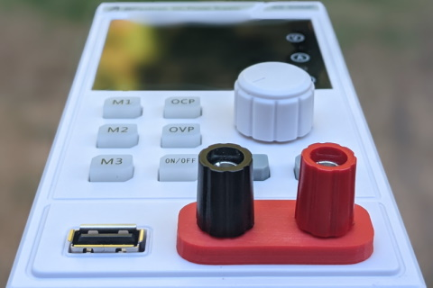

# A-BFastiron SS-305MP Banana Board

Board is intended for placing banana connectors at standard 19.05 mm spacing.

Installing it will require you to first remove the existing board (7 mm deep
socket) and slightly file the panel plastic to allow for correct 19.05 mm
spacing. Correct part stackup is in [parts](Board/ABfastiron-Bananas.md).

---

See also:
* [Board Parts](Board/ABfastiron-Bananas.md)
* [Binding Post Base 3D Model](Board/ABfastiron-Bananas-Binding.md)
* [Spacing Post Spacer 3D Model](Board/ABfastiron-Bananas-Spacing.md)
* [Blog post](https://www.medo64.com/2021/07/changing-a-bfastiron-ss-305mp-binding-posts/)

